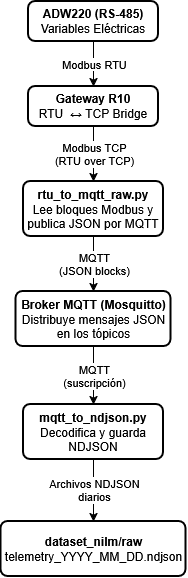

# 📗 Documentación General del Proyecto - Red Inteligente Gamaco

**Proyecto:** Red Inteligente Gamaco  
**Versión:** v1.1  
**Autor:** Juan David Muñoz Buriticá  

---

## 1. Introducción

Este documento presenta una descripción general inicial del **sistema de medición y procesamiento de datos eléctricos** desarrollado en el marco del proyecto *Red Inteligente Gamaco*.  
El sistema integra equipos físicos (analizador de redes **Acrel ADW220** y gateway **R10**) con una infraestructura digital compuesta por un **broker MQTT local** y dos scripts principales de adquisición y almacenamiento de datos.

El objetivo del proyecto es capturar variables eléctricas trifásicas en tiempo real, transmitirlas mediante protocolos industriales e IoT, y estructurar un conjunto de datos (dataset) confiable para hacer análisis energético y aplicaciones de NILM (Non‑Intrusive Load Monitoring).

---

## 2. Componentes del sistema

### 2.1 Medidor ADW220

- **Tipo:** Analizador de redes trifásico con comunicación RS‑485 (Modbus RTU).  
- **Variables medidas:** tensiones de línea y fase, corrientes, potencias activa/reactiva/aparente, factor de potencia, frecuencia, THD de corriente, entre otras.  
- **Configuración utilizada:**
  - Dirección Modbus (Slave ID): `2`
  - Velocidad: `4800 bps`
  - Paridad: `None`
  - Bits de datos: `8`
  - Stop bit: `1`
- Los registros Modbus usados se definen en el archivo `mapping_registers.json`, donde cada variable tiene su dirección (`addr_dec`), tipo (`dtype`), escala (`scale`) y unidad (`unit`).

---

### 2.2 Gateway R10

- **Función:** Pasarela (gateway) que enlaza la red RS‑485 (Modbus RTU) del medidor con una red TCP/IP (Modbus RTU‑over‑TCP).  
- **Configuraciones clave:**
  - **Modo:** *Modbus Master TCP → RTU Slave*
  - **Puerto TCP:** `502`
  - **Tiempo de muestreo:** ajustado mediante el script (`POLL_SEC`)
  - **Interfaz serial:** RS‑485 (Tx/Rx hacia el ADW220)
- El R10 permite que un cliente TCP externo (en este caso el script Python) lea los registros Modbus del analizador como si fuera una conexión directa.

---

### 2.3 Broker MQTT

- **Software:** Mosquitto (local).  
- **Protocolo:** MQTT v3.1.1  
- **Puertos habituales:** `1883` (sin TLS) o `8883` (con TLS).  
- **Estructura de tópicos:**
  - Publicación desde el script `rtu_over_tcp_to_mqtt.py` → `sensors/adw220/dev01/raw`
  - Suscripción desde el script `mqtt_to_ndjson.py` → `sensors/adw220/+/raw`
- El broker actúa como intermediario, recibiendo los mensajes JSON con registros Modbus crudos y reenviándolos a todos los suscriptores activos.

---

### 2.4 Scripts de software

#### a) `rtu_to_mqtt_raw.py`  
- Conecta al gateway R10 vía TCP.  
- Lee los registros Modbus según el mapeo.  
- Publica mensajes JSON (modo *blocks*) al broker MQTT.  

#### b) `mqtt_to_ndjson.py`  
- Se suscribe al tópico MQTT de lectura.  
- Decodifica los registros según el mapeo.  
- Almacena los valores en archivos `telemetry_YYYY-MM-DD.ndjson` dentro de `dataset_nilm/raw`.  

Ambos scripts comparten el archivo `mapping_registers.json` para asegurar la coherencia entre las direcciones Modbus leídas y las variables decodificadas.

---

## 3. Flujo de datos general
> - **Figura 1.** Diagrama de flujo de datos general.
> 

---

## 4. Configuración resumida del sistema

| Elemento | Interfaz / Protocolo | Dirección / Puerto | Descripción |
|-----------|----------------------|--------------------|-------------|
| **ADW220** | RS‑485 / Modbus RTU | Slave ID = 2 | Dispositivo de medición |
| **R10 Gateway** | Ethernet / Modbus RTU‑over‑TCP | IP = 192.168.x.x, Port = 502 | Puente entre TCP y RS‑485 |
| **Broker MQTT** | TCP / MQTT | localhost:1883 | Nodo central de mensajería |
| **Script Bridge** | Python (pymodbus + paho.mqtt) | - | Lectura Modbus y envío MQTT |
| **Script Decoder** | Python (paho.mqtt + pymodbus.payload) | - | Decodificación y almacenamiento NDJSON |

---

## 5. Archivos clave del proyecto

| Archivo | Descripción |
|----------|-------------|
| `mapping_registers.json` | Definición de direcciones y variables Modbus. |
| `.env` | Variables de entorno para los scripts (conexiones y paths). |
| `rtu_to_mqtt_raw.py` | Lee registros y publica por MQTT. |
| `mqtt_to_ndjson.py` | Suscribe, decodifica y almacena NDJSON. |
| `dataset_nilm/raw/` | Carpeta donde se generan los archivos de salida. |

---

## 6. Resultado final

El sistema permite disponer de una **medición continua, estructurada y exportable** de variables eléctricas, con:
- Datos normalizados en formato NDJSON (facilita procesamiento con Python o Pandas).  
- Trazabilidad diaria mediante archivos `meta_YYYY-MM-DD.json`.  
- Integración modular: cada parte (medidor, gateway, scripts, broker) puede reconfigurarse sin alterar las demás.  

---

## 7. Próximos pasos sugeridos

1. Añadir decodificación de bloques FC03 si se incorporan registros configurables.  
2. Integrar un panel de visualización local (Grafana o Node-RED).  
3. Implementar validación automática de calidad de datos (detección de outliers o vacíos).  
4. Desplegar almacenamiento remoto (base de datos o servidor central).  

---
