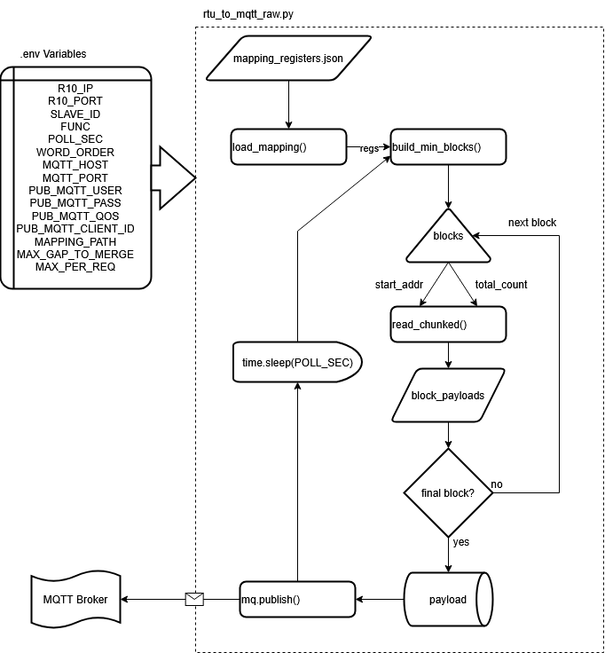
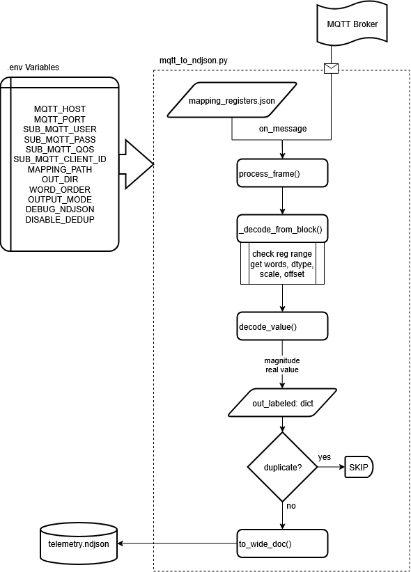

# 📘 Documentación Técnica - Scripts Modbus a NDJSON

**Proyecto:** Red Inteligente Gamaco  
**Versión:** v1.0  
**Autor:** Juan David Muñoz Buriticá  

---

## 1. Introducción

Este documento describe detalladamente el funcionamiento de los dos scripts principales desarrollados para la adquisición, procesamiento y almacenamiento de datos provenientes del analizador de redes **Acrel ADW220** a través del gateway **R10**.

El flujo general implementado consiste en:

1. Lectura periódica de registros Modbus desde el ADW220 por medio del R10, funcionando como pasarela (modo "passthrough") RTU-over-TCP.  
2. Publicación de los datos leídos en formato JSON sobre un **broker MQTT** local.  
3. Recepción de los mensajes MQTT, decodificación de los registros en valores físicos y almacenamiento en formato **NDJSON** para análisis posterior.

Los scripts involucrados son:
- `rtu_to_mqtt_raw.py` → Lectura Modbus y publicación MQTT.  
- `mqtt_to_ndjson.py` → Suscripción MQTT y escritura de archivos NDJSON.

---

## 2. Estructura general del flujo

> - **Figura 1.** Diagrama de flujo del script `rtu_to_mqtt_raw.py`.
>   

> - **Figura 2.** Diagrama de flujo del script `mqtt_to_ndjson.py`.
> 

---

## 3. Script `rtu_to_mqtt_raw.py`

### 3.1 Propósito
Conectarse al gateway **R10** en modo Modbus RTU over TCP, leer los registros especificados en el archivo de mapeo `mapping_registers.json` y publicar los datos en formato JSON al broker MQTT configurado.

### 3.2 Entradas

#### a) Variables de entorno

| Variable | Descripción |
|-----------|--------------|
| `R10_IP` | Dirección IP del gateway R10. |
| `R10_PORT` | Puerto Modbus TCP (por defecto 502). |
| `SLAVE_ID` | ID Modbus del analizador ADW220. |
| `FUNC` | Función Modbus (3 = Holding, 4 = Input). |
| `POLL_SEC` | Intervalo de lectura en segundos. |
| `WORD_ORDER` | Orden de bytes/palabras (“ABCD”, “CDAB”, etc.). |
| `MQTT_HOST`, `MQTT_PORT` | Dirección y puerto del broker MQTT. |
| `PUB_MQTT_TOPIC` | Tópico MQTT de publicación. |
| `PUB_MQTT_USER`, `PUB_MQTT_PASS` | Credenciales MQTT. |
| `PUB_MQTT_QOS` | Nivel de QoS MQTT (0–2). |
| `PUB_MQTT_CLIENT_ID` | Identificador del cliente publicador. |
| `MAPPING_PATH` | Ruta del archivo de mapeo JSON. |
| `MAX_GAP_TO_MERGE` | Máximo hueco entre direcciones contiguas para agrupar bloques. |
| `MAX_PER_REQ` | Máximo número de registros por lectura Modbus (≤125 recomendado). |

#### b) Archivos
- `mapping_registers.json`: define las direcciones Modbus, tipos de datos y etiquetas de cada variable a leer.

---

### 3.3 Descripción de funciones principales

| Función | Descripción |
|----------|--------------|
| `load_mapping(path)` | Carga el archivo JSON de mapeo, filtra registros según la función (`FUNC`), y devuelve una lista de tuplas `(addr, words)`. |
| `build_min_blocks(regs)` | Agrupa las direcciones contiguas en bloques mínimos de lectura `(start_addr, count)` considerando `MAX_GAP_TO_MERGE`. |
| `read_chunked(mb, start_addr, total_count, slave_id, func)` | Realiza lecturas Modbus en trozos ≤ `MAX_PER_REQ`, concatenando los registros válidos. En caso de error, rellena con ceros. |
| `mqtt_connect()` | Crea y conecta el cliente MQTT para la publicación. |
| `main()` | Controla el flujo principal: carga mapeo, calcula bloques, lee cada bloque, arma el mensaje JSON y lo publica periódicamente. |

---

### 3.4 Formato del mensaje MQTT publicado

```json
{
  "ts": "2025-10-15T14:01:02.123456+00:00",
  "device": "adw220",
  "slave": 2,
  "word_order": "ABCD",
  "mode": "blocks",
  "blocks": [
    {
      "start_addr": 256,
      "count": 40,
      "regs": [123, 456, 789, ...],
      "func": 4
    },
    {
      "start_addr": 825,
      "count": 3,
      "regs": [98, 77, 12],
      "func": 4
    }
  ]
}
```

---

### 3.5 Salida
- **Destino:** Tópico MQTT configurado (`PUB_MQTT_TOPIC`).  
- **Frecuencia:** cada `POLL_SEC` segundos.  
- **Contenido:** bloques con valores crudos (`regs` = lista de words Modbus 16-bit).

---

## 4. Script `mqtt_to_ndjson.py`

### 4.1 Propósito
Suscribirse al tópico MQTT donde el bridge publica los frames, decodificar los registros a magnitudes reales usando el mapeo, y generar archivos **NDJSON diarios** (`telemetry_YYYY-MM-DD.ndjson`).

---

### 4.2 Entradas

#### a) Variables de entorno

| Variable | Descripción |
|-----------|--------------|
| `MQTT_HOST`, `MQTT_PORT` | Dirección y puerto del broker MQTT. |
| `SUB_MQTT_TOPIC` | Tópico de suscripción (ej. `sensors/adw220/+/raw`). |
| `SUB_MQTT_USER`, `SUB_MQTT_PASS` | Credenciales MQTT. |
| `SUB_MQTT_QOS` | Nivel de QoS (0–2). |
| `SUB_MQTT_CLIENT_ID` | Identificador del cliente suscriptor. |
| `MAPPING_PATH` | Ruta del archivo de mapeo. |
| `OUT_DIR` | Carpeta donde se almacenarán los NDJSON. |
| `OUTPUT_MODE` | Formato de salida: `wide` o `tidy`. |
| `DEBUG_NDJSON` | Habilita impresión de información de depuración. |
| `DISABLE_DEDUP` | Desactiva la eliminación de duplicados. |

#### b) Archivos
- `mapping_registers.json` (mismo mapeo usado por el bridge).

---

### 4.3 Descripción de funciones principales

| Función | Descripción |
|----------|--------------|
| `mqtt_connect()` | Crea y conecta el cliente MQTT para suscribirse. |
| `on_message(client, userdata, msg)` | Callback que decodifica el payload MQTT y lo pasa a `process_frame()`. |
| `process_frame(frame)` | Gestiona todo el procesamiento de un mensaje: selecciona el modo (blocks o contiguo), llama `_decode_from_block()`, aplica deduplicación y escribe NDJSON. |
| `_decode_from_block(ts, device, word_order, start_addr, regs, out_labeled, out_points)` | Recorre el mapeo y decodifica las señales que caen dentro del rango de direcciones del bloque. |
| `decode_value(words, word_order, dtype, scale, offset)` | Convierte los registros Modbus (words) a valores reales respetando el tipo de dato (`float32`, `int16`, etc.) y el orden de bytes/palabras. |
| `to_wide_doc(ts, device, labeled_dict)` | Genera un documento “ancho”: una fila con todas las variables del dispositivo. |
| `to_tidy_doc(ts, device, points)` | Genera un documento “largo”: lista de mediciones individuales con metadatos. |
| `ensure_day_files(day)` | Garantiza la existencia del archivo `meta_<day>.json` con el mapping del día. |

---

### 4.4 Formato del mensaje MQTT recibido

#### a) Modo “blocks”
```json
{
  "ts": "2025-10-15T14:01:02.123456+00:00",
  "device": "adw220",
  "word_order": "ABCD",
  "mode": "blocks",
  "blocks": [
    {"start_addr":256, "count":40, "regs":[...]},
    {"start_addr":825, "count":3,  "regs":[...]}
  ]
}
```

#### b) Modo “contiguo” (legacy)
```json
{
  "ts": "...",
  "device": "adw220",
  "word_order": "ABCD",
  "start_addr":256,
  "count":40,
  "regs":[...]
}
```

---

### 4.5 Formato de salida NDJSON

#### a) Modo **wide**
```json
{
  "ts": "2025-10-15T14:01:02.123456+00:00",
  "device": "adw220",
  "U_L1":119.8, "I_L1":3.21, "P_L1":1.12, "THDi_L1":4.17, ...
}
```

#### b) Modo **tidy**
```json
{
  "ts": "2025-10-15T14:01:02.123456+00:00",
  "device": "adw220",
  "measurements": [
    {"label":"U_L1","value":119.8,"unit":"V","quantity":"Voltage","phase":"A"},
    {"label":"I_L1","value":3.21,"unit":"A","quantity":"Current","phase":"A"},
    {"label":"THDi_L1","value":4.17,"unit":"%","quantity":"THD_Current","phase":"A"}
  ]
}
```

---

### 4.6 Proceso de deduplicación

Cada línea NDJSON se genera solo si el hash SHA-1 del conjunto de valores (`labeled`) difiere del último guardado para el mismo dispositivo.

Esto evita almacenar líneas idénticas cuando no hay cambios en las mediciones.  
Se puede desactivar estableciendo: `DISABLE_DEDUP=1`

---

### 4.7 Archivos generados

| Archivo | Descripción |
|----------|-------------|
| `meta_<YYYY-MM-DD>.json` | Copia del mapping utilizado ese día (solo se genera una vez). |
| `telemetry_<YYYY-MM-DD>.ndjson` | Archivo NDJSON con una línea por frame decodificado. |

---

## 5. Flujo de datos completo

| Etapa | Origen | Destino | Descripción |
|-------|---------|----------|-------------|
| 1 | ADW220 vía RS-485 | R10 Gateway | Lectura Modbus RTU |
| 2 | R10 | Script `rtu_over_tcp_to_mqtt.py` | Conexión TCP Modbus, lectura periódica |
| 3 | `rtu_over_tcp_to_mqtt.py` | Broker MQTT | Publicación de frames JSON |
| 4 | Broker MQTT | Script `mqtt_to_ndjson.py` | Recepción de frames |
| 5 | `mqtt_to_ndjson.py` | Archivos NDJSON | Decodificación y almacenamiento |

---
